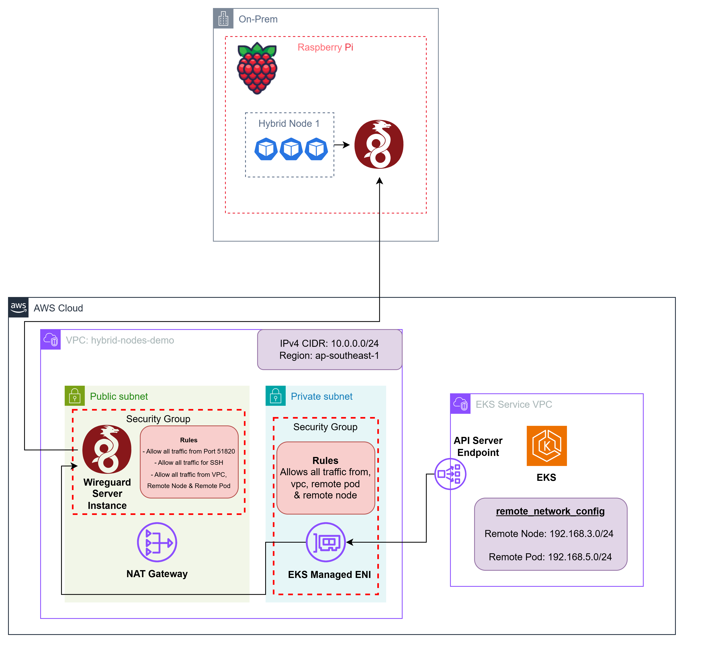

# EKS Hybrid Nodes on Raspberry Pi

## Table of Contents
- [Introduction](#introduction)
- [Architecture](#architecture)
- [Prerequisites](#prerequisites)
  - [Hardware Requirements](#hardware-requirements)
  - [Software Requirements](#software-requirements)
- [Getting Started](#getting-started)
- [Setup Process](#setup-process)
  - [1. AWS Infrastructure Setup](#1-aws-infrastructure-setup)
  - [2. Raspberry Pi Setup](#2-raspberry-pi-setup)
  - [3. Setup CNI](#3-setup-cni)
- [Verification](#verification)
- [Clean Up](#clean-up)
- [Disclaimer](#disclaimer)
- [Contributing](#contributing)
- [License](#license)

---

## Introduction

Amazon EKS Hybrid Nodes is a powerful feature that enables you to extend your Amazon EKS clusters to include on-premises and edge infrastructure as worker nodes. This means you can:

✨ Run Kubernetes workloads on your own hardware while AWS manages the control plane  
✨ Unify Kubernetes management across cloud and on-premises environments  
✨ Leverage AWS services and EKS features with your on-premises nodes  
✨ Pay only for the vCPU resources of your hybrid nodes when they're attached to EKS clusters  

This repository demonstrates how to implement EKS Hybrid Nodes using one of the most accessible and cost-effective platforms available - the Raspberry Pi. By following this guide, you'll learn how to:

1. Transform a Raspberry Pi into an EKS hybrid node
2. Connect it securely to your EKS cluster
3. Deploy and manage workloads across your hybrid infrastructure

Our goal is to showcase that setting up hybrid nodes doesn't need to be complex or expensive. This implementation serves as an excellent starting point for learning about EKS Hybrid Nodes or prototyping hybrid scenarios before deploying to production environments.

---

## Architecture



> **Important Note on Network Architecture:**
> - The EKS cluster is configured with public endpoint access only
> - Raspberry Pi → EKS control plane communication flows through the internet via the public endpoint
> - EKS control plane → Raspberry Pi communication is established through the VPN tunnel

---

## Prerequisites

### Hardware Requirements
- **Raspberry Pi 4** or **Raspberry Pi 5**
  > Should also work with devices running ARM but no guarantees
- Network connectivity (WiFi/Ethernet)
- SSH access configured

### Software Requirements
> Ensure you have the following tools installed:
- [AWS CLI](https://docs.aws.amazon.com/cli/latest/userguide/cli-chap-getting-started.html)
- [Session Manager plugin for AWS CLI](https://docs.aws.amazon.com/systems-manager/latest/userguide/session-manager-working-with-install-plugin.html)
- [kubectl](https://kubernetes.io/docs/tasks/tools/)
- [terraform](https://developer.hashicorp.com/terraform/tutorials/aws-get-started/install-cli)

> **Important IAM Requirements:**
> - An IAM role named `Admin` must exist in your AWS account
> - This role will be granted cluster admin permissions through the `AmazonEKSClusterAdminPolicy`
> - If you want to use a different role name, modify the `principal_arn` in `terraform/eks.tf`

---

## Getting Started

Clone the repository:
```bash
git clone https://github.com/aws-samples/sample-eks-hybrid-nodes-raspberry-pi.git
```

---

## Setup Process

### 1. AWS Infrastructure Setup

> **Important Configuration Notes:**
> 
> **Region Selection:**
> This demo uses the `ap-southeast-1` (Singapore) region by default. To use a different region:
> 1. Open `terraform/variables.tf`
> 2. Locate the `region` variable
> 3. Change the default value to your desired AWS region (e.g., `us-west-2`, `eu-west-1`)
>
> **EKS Version:**
> - Update in `terraform/variables.tf`
> - However, need to be more than version 1.31
>
> **Network Configuration:**  
> Before proceeding, check your node IP CIDR and update the `remote_node_cidr` in `terraform/variables.tf` accordingly. The default is set to `192.168.3.0/24`.

```bash
export KUBE_CONFIG_PATH=~/.kube/config

# Deploy AWS infrastructure using Terraform
cd terraform

terraform init
terraform apply --auto-approve

$(terraform output -raw eks_update_kubeconfig)
```

> **Note on Admin Access:** If you encounter permission errors and don't have an Admin role, you can remove the admin access configuration:
> ```bash
> # Remove admin access configuration from eks.tf
> sed -i '29,39d' eks.tf
> 
> # Reapply terraform to update the configuration
> terraform apply --auto-approve
> ```
> This will use only the cluster creator permissions, which are sufficient if you created the cluster yourself.

**Terraform Output Files:**
- `SETUP_VPN.md`: Steps to setup Wireguard on vpn_server
- `SETUP_NODE.md`: Steps to setup nodeadm on the on-prem device
- `cilium-values.yaml`: Config file used to setup Cilium
- `karpenter.yaml`: EC2 Nodeclass and Nodepool configuration for Karpenter

**Important Terraform Outputs:**
- `eks_update_kubeconfig`: How to access cluster
- `connect_vpn_server`: How to connect to vpn_server using SSM

#### Setup Karpenter and Kube Proxy

We shall use Karpenter to provision nodes on the Cloud. While, we need to setup Kube Proxy to run only on Cloud Nodes. Cilium will be used to proxy on the Hybrid Nodes.

**Step 1:** Apply the Karpenter configuration:
```bash
kubectl apply -f generated-files/karpenter.yaml
```

**Step 2:** Configure Kube Proxy with the correct region affinity:
```bash
# Replace "ap-southeast-1" with your AWS region
kubectl patch ds -n kube-system kube-proxy -p '{"spec": {"template": {"spec": {"affinity": {"nodeAffinity": {"requiredDuringSchedulingIgnoredDuringExecution": {"nodeSelectorTerms": [{"matchExpressions": [{"key": "topology.kubernetes.io/region", "operator": "In", "values": ["ap-southeast-1"]}]}]}}}}}}}'
```

> **Important:** Make sure to replace `ap-southeast-1` in the command above with the AWS region you're using for your deployment. This ensures that kube-proxy pods are scheduled only on nodes in your specific region.

#### VPN Server Setup
We use Wireguard for site-to-site VPN in this demo. This is how our EKS Cluster communicates with the Raspberry Pi.  
We setup Wireguard by installing the Wireguard server on an EC2 instance running in our AWS Account. Then we will setup the Wireguard client on our on-prem device.  

**Step 1:** Review the Wireguard setup instructions in the SETUP_VPN.md file that was generated in your terraform directory.
```bash
cat generated-files/SETUP_VPN.md
```

**Step 2:** Get the VPN server's public IP address using Terraform
```bash
terraform output vpn_server_public_ip
```
> **Note:** Save this IP address as you will need it for the Raspberry Pi Wireguard configuration.

**Step 3:** Connect to VPN server using SSM
```bash
$(terraform output -raw connect_vpn_server)
```

**Step 4:** Follow the instructions from SETUP_VPN.md to set up Wireguard on the VPN server.

**Step 5:** Get the required key values for Raspberry Pi setup
```bash
# Switch to root user
sudo -i

# Get the public key
cat /etc/wireguard/public.key

# Get the client private key
cat /etc/wireguard/client-private.key
```
> **Note:** Save these key values as you will need them later for the Raspberry Pi Wireguard configuration.

---

### 2. Raspberry Pi Setup

1. **Install Wireguard:**
```bash
sudo apt update && sudo apt install -y wireguard
sudo mkdir -p /etc/wireguard
```

2. **Create WireGuard Configuration:**
```bash
sudo nano /etc/wireguard/wg0.conf
```

Add the following configuration (replace placeholders):
```ini
[Interface]
PrivateKey = <client-private.key>
Address = 10.200.0.2/24

[Peer]
# Public key from AWS server (/etc/wireguard/public.key)
PublicKey = <public.key>
# Your EC2 instance's public IP
Endpoint = <ec2-public-ip>:51820
# WireGuard server network, AWS VPC CIDR & EKS Service CIDR
AllowedIPs = 10.200.0.1/24,10.0.0.0/24,172.16.0.0/16
PersistentKeepalive = 25
```

> **Important:** Replace the following:
> - `<client-private.key>` with the client-private.key from VPN Server
> - `<public.key>` with the public.key from VPN Server
> - `<ec2-public-ip>` with VPN Server's Public IP

3. **Enable and Start Wireguard:**
```bash
sudo echo "net.ipv4.ip_forward=1" | sudo tee -a /etc/sysctl.conf
sudo sysctl -p

sudo systemctl enable wg-quick@wg0
sudo systemctl start wg-quick@wg0

# Verify connection
sudo wg show
```

4. **Complete Node Setup:**
```bash
# View setup instructions from the folder containing your terraform files
cat SETUP_NODE.md
```

> **Troubleshooting:** If you encounter issues, refer to the [official troubleshooting guide](https://docs.aws.amazon.com/eks/latest/userguide/hybrid-nodes-troubleshooting.html).
>
> ⚠️ **Common Issue:** If you get `ExpiredTokenException: The security token included in the request is expired`, the SSM Hybrid Activation Credentials have expired. Rerun `terraform init` & `terraform apply` and restart the `SETUP_NODE.md` steps.

---

### 3. Setup CNI

1. **Install Helm** (if not already installed):
```bash
curl -fsSL -o get_helm.sh https://raw.githubusercontent.com/helm/helm/main/scripts/get-helm-3
chmod 700 get_helm.sh
./get_helm.sh
```

2. **Add Cilium Repository:**
```bash
# New installation
helm repo add cilium https://helm.cilium.io/

# Or update existing
helm repo update
```

3. **Install Cilium:**
```bash
helm install cilium cilium/cilium \
    --version 1.17.1 \
    --namespace kube-system \
    --values generated-files/cilium-values.yaml 
```

4. **Configure CoreDNS:**
Wait for Cilium to be deployed (so that our Hybrid Node is in a Ready state)
```bash
# First get the endpoint
ENDPOINT=$(terraform output -raw eks_cluster_endpoint)

# Then use it in the patch command
cat << 'EOF' | kubectl patch deployment coredns -n kube-system --patch-file /dev/stdin
{
  "spec": {
    "strategy": {
      "rollingUpdate": {
        "maxSurge": 0,
        "maxUnavailable": 1
      }
    },
    "replicas": 3,
    "template": {
      "spec": {
        "affinity": {
          "podAntiAffinity": {
            "preferredDuringSchedulingIgnoredDuringExecution": [
              {
                "podAffinityTerm": {
                  "labelSelector": {
                    "matchExpressions": [
                      {
                        "key": "k8s-app",
                        "operator": "In",
                        "values": [
                          "kube-dns"
                        ]
                      }
                    ]
                  },
                  "topologyKey": "kubernetes.io/hostname"
                },
                "weight": 100
              },
              {
                "podAffinityTerm": {
                  "labelSelector": {
                    "matchExpressions": [
                      {
                        "key": "k8s-app",
                        "operator": "In",
                        "values": [
                          "kube-dns"
                        ]
                      }
                    ]
                  },
                  "topologyKey": "topology.kubernetes.io/zone"
                },
                "weight": 50
              }
            ]
          }
        }
      }
    }
  }
}
EOF

kubectl patch deployment coredns -n kube-system --patch '
{
  "spec": {
    "template": {
      "spec": {
        "containers": [{
          "name": "coredns",
          "env": [
            {
              "name": "KUBERNETES_SERVICE_HOST",
              "value": "'$ENDPOINT'"
            },
            {
              "name": "KUBERNETES_SERVICE_PORT",
              "value": "443"
            }
          ]
        }]
      }
    }
  }
}'

kubectl rollout restart deployment coredns -n kube-system
```
Do double check to see if there is a CoreDNS running on the Hybrid Node - if not delete one of the pods to let it be provisioned on the Hybrid Node.

Finally, setup kube-dns:
```bash
kubectl patch svc kube-dns -n kube-system --type=merge -p '{
  "spec": {
    "trafficDistribution": "PreferClose"
  }
}'
```

---

## Verification

```bash
# Check node status
kubectl get nodes

# View running pods
kubectl get pods -A
```

✅ Check your AWS Console - a new node should appear in your EKS Cluster once Cilium is properly configured.

🎉 **Congratulations!** Your Raspberry Pi is now a Hybrid Node in your EKS Cluster.

---

## Deploy Demo Application

After your hybrid node is successfully connected, you can try our demo applications:

### 1. Latency Comparison Demo
Try our [latency comparison demo](examples/latency-comparison-demo/README.md) which showcases the latency differences between pods running on AWS EKS cloud nodes versus pods running on Raspberry Pi hybrid nodes.

### 2. Hybrid Processing Pipeline Demo
Experience a real-world IoT scenario with our [hybrid processing pipeline demo](examples/hybrid-processing-pipeline-demo/README.md) that demonstrates:
- Data generation at the edge (Raspberry Pi)
- Cloud-based processing with Redis
- Real-time visualization dashboard
- Anomaly detection and statistical analysis

This demo showcases how to effectively distribute workloads between edge devices and the cloud, with:
- Edge-based data generation on the Pi
- Cloud-based data processing for heavy computations
- Real-time monitoring and visualization
- Hybrid architecture leveraging both Pi and cloud resources

### 3. Ultrasonic Sensor Demo
Explore real-time IoT sensor monitoring with our [ultrasonic sensor demo](examples/ultrasonic-demo/README.md) that demonstrates:
- Physical sensor integration with HC-SR04 ultrasonic sensor
- Edge-based sensor data collection and processing
- Cloud storage with DynamoDB time-series data
- Professional web dashboard with real-time visualization
- Statistical analysis and anomaly detection

This demo illustrates practical IoT applications and hybrid architecture benefits:
- Real-time sensor processing at the edge for low latency
- Cloud persistence for data analytics and historical trends
- Modern dashboard with animated gauges and interactive charts
- Hardware integration showing tangible edge computing benefits


## Clean Up

### 1. Remove Node from Cluster
```bash
# Get node name
HYBRID_NODE=$(kubectl get nodes -l eks.amazonaws.com/compute-type=hybrid -o jsonpath='{.items[0].metadata.name}')

# Uninstall Cilium
helm uninstall cilium -n kube-system

# Drain and delete node
kubectl drain $HYBRID_NODE --ignore-daemonsets
kubectl delete node $HYBRID_NODE
```

### 2. Clean up Raspberry Pi
Use the `cleanup-pi.sh` script in the cleanup folder to remove Hybrid Node and Wireguard configuration.

### 3. Destroy Cluster
```bash
terraform destroy --auto-approve
```

---

## Disclaimer

⚠️ **This repository is intended for demonstration and learning purposes only.**
It is **not** intended for production use. The code provided here is for educational purposes and should not be used in a live environment without proper testing, validation, and modifications.

Use at your own risk. The authors are not responsible for any issues, damages, or losses that may result from using this code in production.

## Contributing

Contributions welcome! Please read our [Contributing Guidelines](CONTRIBUTING.md) and [Code of Conduct](CODE_OF_CONDUCT.md).

## License

This project is licensed under the MIT License - see [LICENSE](LICENSE) file.
