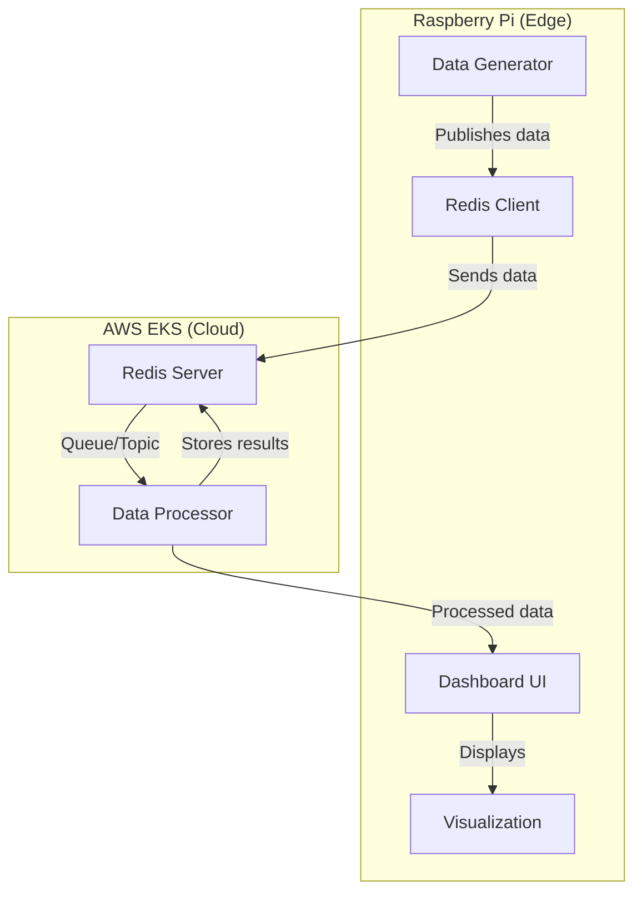
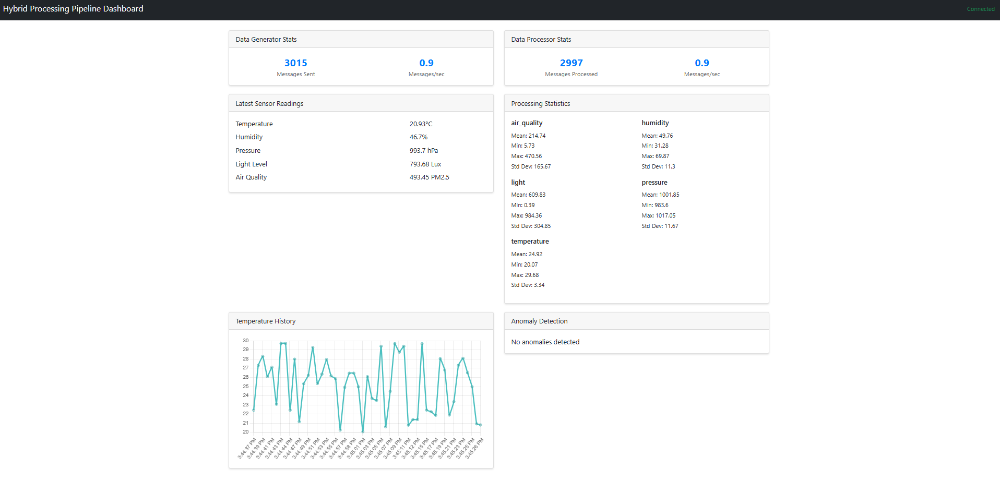

# EKS Hybrid Nodes Processing Pipeline Demo

This demo showcases a hybrid IoT data processing pipeline using Amazon EKS with both cloud nodes and Raspberry Pi hybrid nodes. It demonstrates how to effectively distribute workloads between edge devices and the cloud in a real-world IoT scenario.

## Architecture Overview



## Components

### 1. Data Generator (Pi)
- Runs on the Raspberry Pi to simulate IoT/sensor data collection at the edge
- Generates simulated sensor data including:
  - Temperature (°C)
  - Humidity (%)
  - Pressure (hPa)
  - Light level (Lux)
  - Air quality (PM2.5)
- Publishes data to Redis Pub/Sub channel
- Maintains performance statistics

### 2. Redis Server (Cloud)
- Runs on cloud nodes as the central message broker
- Handles Pub/Sub communication between components
- Stores latest raw and processed data
- Maintains system statistics

### 3. Data Processor (Cloud)
- Runs on cloud nodes to perform "heavy" data processing
- Features:
  - Sliding window data analysis
  - Statistical calculations (mean, min, max, standard deviation)
  - Anomaly detection using 2-sigma rule
  - Performance monitoring
- Processes data in configurable time windows
- Stores results back in Redis

### 4. Dashboard (Pi)
- Web-based visualization interface running on the Pi
- Displays:
  - Real-time sensor data
  - Processing statistics
  - System metrics
  - Anomaly detection results

## Prerequisites

- EKS cluster with both cloud nodes and Raspberry Pi hybrid nodes
- `kubectl` configured to access your cluster
- Docker installed on your Raspberry Pi
- Access to a container registry (e.g., local registry on Pi)

## Setup Process

### 1. Create Namespace
```bash
kubectl apply -f namespace.yaml

# Deploy Redis
kubectl apply -f redis.yaml

# Data Generator (on Pi)
kubectl apply -f data-generator.yaml

# Data Processor (on Pi or cloud machine)
kubectl apply -f data-processor.yaml

# Dashboard (on Pi)
kubectl apply -f dashboard.yaml
```

### 2. Access the Dashboard

The dashboard is exposed as a NodePort service on port 30080. Access it using your Raspberry Pi's IP address:

```bash
# Get Pi's IP
HYBRID_NODE=$(kubectl get nodes -l eks.amazonaws.com/compute-type=hybrid -o jsonpath='{.items[0].metadata.name}')
PI_IP=$(kubectl get nodes $HYBRID_NODE -o yaml | grep 'address: ' | head -1 | awk '{print $3}')
echo "Access dashboard at http://$PI_IP:30080"
```



## Configuration

### Data Generator
- `SENSOR_INTERVAL`: Time between sensor readings (default: 1 second)
- `REDIS_HOST`: Redis server hostname
- `REDIS_PORT`: Redis server port

### Data Processor
- `PROCESSING_WINDOW`: Time window for data analysis (default: 10 seconds)
- `REDIS_HOST`: Redis server hostname
- `REDIS_PORT`: Redis server port

## Monitoring

### Dashboard Features
1. **Real-time Data Display**
   - Current sensor readings
   - Historical data trends
   - Processing statistics

2. **System Metrics**
   - Data generation rate
   - Processing rate
   - System uptime
   - Message counts

3. **Anomaly Detection**
   - Anomaly thresholds
   - Detected anomalies
   - Deviation metrics

## Cleanup

To remove all demo components:
```bash
kubectl delete namespace hybrid-pipeline-demo
```

## Understanding the Demo

This demo illustrates several key concepts:

1. **Edge-Cloud Hybrid Architecture**
   - Data collection at the edge (Pi)
   - Processing in the cloud
   - Visualization back at the edge

2. **Real-time Data Processing**
   - Continuous data generation
   - Window-based processing
   - Statistical analysis
   - Anomaly detection

3. **System Monitoring**
   - Performance metrics
   - System health
   - Processing statistics

4. **Kubernetes Features**
   - Node affinity/selection
   - Resource management
   - Service discovery
   - Container orchestration

## Customization

You can modify the demo by:
1. Adding new sensor types to the data generator
2. Implementing different processing algorithms
3. Enhancing the dashboard visualization
4. Adjusting processing windows and thresholds
5. Adding more complex anomaly detection