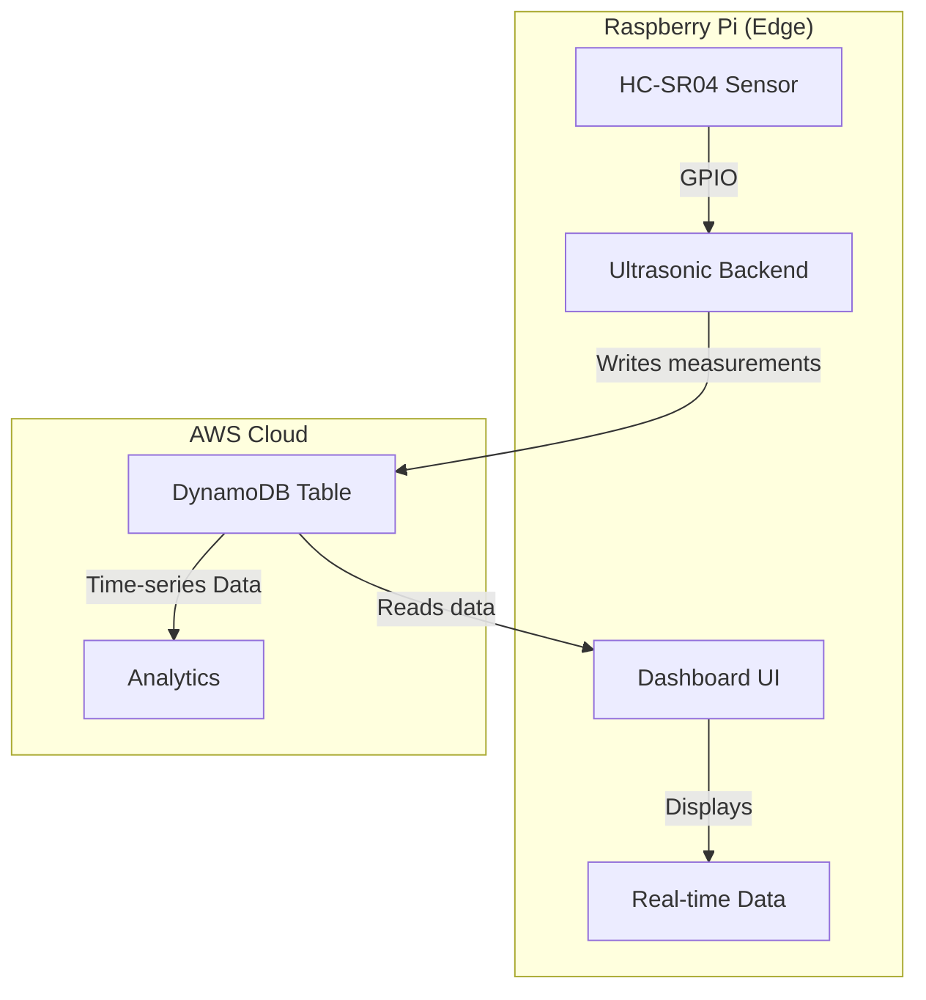

# EKS Hybrid Nodes Ultrasonic Sensor Demo

This demo showcases real-time IoT sensor monitoring using Amazon EKS with Raspberry Pi hybrid nodes. It demonstrates edge-based sensor data collection with cloud storage and visualization, representing a common manufacturing and IoT use case.

## Overview

The demo consists of:

1. **Ultrasonic Sensor**: Reads distance measurements from HC-SR04 sensor on Raspberry Pi
2. **Dashboard**: Web-based visualization interface for real-time and historical data
3. **DynamoDB Storage**: Time-series data storage in AWS cloud

## Architecture



## Why Edge Computing?

This demo illustrates edge computing benefits:
- **Low-latency response**: Real-time sensor processing at the edge
- **Reduced bandwidth**: Local processing before cloud transmission
- **Reliability**: Local operation continues during connectivity issues
- **Cost optimization**: Edge processing reduces cloud compute costs

## Components

### 1. Ultrasonic Backend (Pi)
- Reads HC-SR04 ultrasonic sensor via GPIO pins
- Processes distance measurements locally
- Writes time-series data to DynamoDB
- Runs as privileged container with GPIO access

### 2. Dashboard Frontend (Pi)
- Flask web application with real-time visualization
- Interactive charts showing current and historical data
- Performance statistics and activity monitoring
- Modern responsive UI with animated components

### 3. DynamoDB Storage (Cloud)
- Time-series table with efficient date-based partitioning
- Schema: Partition key (yyyymmdd), Sort key (hhmmss)
- Optimized for time-based queries and analytics

## Prerequisites

- EKS cluster with both cloud nodes and Raspberry Pi hybrid nodes
- `kubectl` configured to access your cluster
- **Hardware Requirements**:
  - HC-SR04 Ultrasonic Sensor
  - 1kΩ and 2kΩ Resistors (voltage divider)
  - Jumper wires and breadboard
- Docker and container registry access for building images

## Hardware Setup

**Connections**:
- VCC → Pi 3.3V
- GND → Pi GND  
- TRIG → GPIO 4
- ECHO → Voltage divider → GPIO 17

*Note: Use voltage divider (1kΩ and 2kΩ resistors) to reduce 5V ECHO signal to safe 3.3V for Pi GPIO input.*

## Building Images

### Step 1: Setup ECR Repository

First, get your ECR public registry alias:

```bash
# Get your ECR public registry alias
ECR_ALIAS=$(aws ecr-public describe-registries --region us-east-1 --query 'registries[0].aliases[0].name' --output text)
echo "Your ECR alias is: $ECR_ALIAS"
```

### Step 2: Create Repository

Create a new ECR repository for the ultrasonic demo:

```bash
# Create ECR repository for the ultrasonic demo
aws ecr-public create-repository --repository-name eks-hybrid-ultrasonic-demo --region us-east-1
```

### Step 3: Authenticate Docker

Authenticate Docker to your ECR registry:

```bash
# Get login token and authenticate Docker to ECR
aws ecr-public get-login-password --region us-east-1 | docker login --username AWS --password-stdin public.ecr.aws
```

### Step 4: Build Backend Image

Build and push the backend sensor application:

```bash
# Build and push backend image
cd ultrasonic-backend
docker build -t public.ecr.aws/$ECR_ALIAS/eks-hybrid-ultrasonic-demo:backend .
docker push public.ecr.aws/$ECR_ALIAS/eks-hybrid-ultrasonic-demo:backend
```

### Step 5: Build Frontend Image

Build and push the frontend dashboard:

```bash
# Build and push frontend image  
cd ../ultrasonic-frontend
docker build -t public.ecr.aws/$ECR_ALIAS/eks-hybrid-ultrasonic-demo:frontend .
docker push public.ecr.aws/$ECR_ALIAS/eks-hybrid-ultrasonic-demo:frontend
```

### Step 6: Update Manifests

Update the Kubernetes manifests with your built images and region:

```bash
# Get the region from terraform variables
AWS_REGION=$(grep -A 1 'variable "region"' ../../terraform/variables.tf | grep 'default' | cut -d'"' -f4)

# Update manifest files with your built images
sed -i "s|<your_backend_image_name>|public.ecr.aws/$ECR_ALIAS/eks-hybrid-ultrasonic-demo:backend|g" ../ultrasonic-backend/manifest.yaml
sed -i "s|<your_frontend_image_name>:<tag>|public.ecr.aws/$ECR_ALIAS/eks-hybrid-ultrasonic-demo:frontend|g" ../ultrasonic-frontend/dashboard.yaml

# Update region in manifest files
sed -i "s|dynamo-region: \"ap-southeast-1\"|dynamo-region: \"$AWS_REGION\"|g" ../ultrasonic-backend/manifest.yaml
sed -i "s|value: \"ap-southeast-1\"|value: \"$AWS_REGION\"|g" ../ultrasonic-frontend/dashboard.yaml
sed -i "s|dynamo-region: \"ap-southeast-1\"|dynamo-region: \"$AWS_REGION\"|g" ../ultrasonic-frontend/dashboard.yaml
```

## Setup Process

If still in the terraform folder:
```bash
cd ../examples/ultrasonic-demo
```

### 1. Create DynamoDB Table

Create the DynamoDB table for storing time-series sensor data:

```bash
# Get the region from terraform variables
AWS_REGION=$(grep -A 1 'variable "region"' ../../terraform/variables.tf | grep 'default' | cut -d'"' -f4)

# Create DynamoDB table with date-based partitioning
aws dynamodb create-table \
    --table-name eks-timeseries \
    --attribute-definitions \
        AttributeName=yyyymmdd,AttributeType=S \
        AttributeName=hhmmss,AttributeType=S \
    --key-schema \
        AttributeName=yyyymmdd,KeyType=HASH \
        AttributeName=hhmmss,KeyType=RANGE \
    --billing-mode PAY_PER_REQUEST \
    --region $AWS_REGION

# Verify table creation
aws dynamodb describe-table --table-name eks-timeseries --region $AWS_REGION
```

### 2. Deploy Backend Sensor Application

```bash
# Deploy the ultrasonic sensor backend
kubectl apply -f ultrasonic-backend/manifest.yaml

# Verify deployment
kubectl get pods -l app=ultrasonic-sensor
kubectl logs -f deployment/ultrasonic-sensor
```

### 3. Deploy Frontend Dashboard

```bash
# Deploy the dashboard
kubectl apply -f ultrasonic-frontend/dashboard.yaml

# Wait for deployment
kubectl wait --for=condition=available deployment/ultrasonic-dashboard --timeout=120s
```

## Access the Dashboard

The dashboard is exposed as a NodePort service on port 30090. Access it using your Raspberry Pi's IP address:

```bash
# Get Pi's IP
HYBRID_NODE=$(kubectl get nodes -l eks.amazonaws.com/compute-type=hybrid -o jsonpath='{.items[0].metadata.name}')
PI_IP=$(kubectl get nodes $HYBRID_NODE -o yaml | grep 'address: ' | head -1 | awk '{print $3}')
echo "Access dashboard at http://$PI_IP:30090"
```

## Dashboard Features

1. **Real-time Monitoring**
   - Current distance readings with animated gauges
   - Live sensor status and connection health
   - Performance metrics and uptime statistics

2. **Historical Analysis**
   - Interactive time-series charts (1H, 6H, 24H views)
   - Statistical analysis (min, max, average, range)
   - Movement detection and stability metrics

3. **Activity Feed**
   - Real-time event logging
   - Anomaly detection alerts
   - System status updates

## Configuration

### Backend Environment Variables
- `TABLE_NAME`: DynamoDB table name (default: "eks-timeseries")
- `WRITE_INTERVAL`: Write interval in seconds (default: 60)
- `DYNAMO_REGION`: AWS region (dynamically set from terraform variables)
- `SAMPLING_INTERVAL`: Sensor sampling interval (default: 20)
- `PIN_TRIGGER`: GPIO trigger pin (default: 4)
- `PIN_ECHO`: GPIO echo pin (default: 17)

### Frontend Environment Variables
- `TABLE_NAME`: DynamoDB table name (default: "eks-timeseries")
- `DYNAMO_REGION`: AWS region (dynamically set from terraform variables)

## Cleanup

```bash
# Remove the deployments
kubectl delete -f ultrasonic-backend/manifest.yaml
kubectl delete -f ultrasonic-frontend/dashboard.yaml

# Get the region from terraform variables and remove DynamoDB table
AWS_REGION=$(grep -A 1 'variable "region"' ../../terraform/variables.tf | grep 'default' | cut -d'"' -f4)
aws dynamodb delete-table --table-name eks-timeseries --region $AWS_REGION
```

## Understanding the Demo

This demo illustrates key hybrid cloud-edge concepts:

1. **Edge Processing**: Sensor data is processed locally on the Pi, reducing latency and enabling real-time responses
2. **Cloud Storage**: Time-series data is stored in DynamoDB for persistence and analytics
3. **Hybrid Visualization**: Dashboard runs on the edge but accesses cloud data, demonstrating flexible deployment patterns
4. **IoT Integration**: Real hardware sensor integration shows practical IoT applications
5. **Kubernetes Native**: Uses standard Kubernetes patterns with ConfigMaps, ServiceAccounts, and health probes

## Customization

You can extend this demo by:
- Adding multiple sensor types (temperature, humidity, etc.)
- Implementing local alerting and threshold monitoring
- Adding machine learning models for anomaly detection
- Integrating with other AWS services (SNS, SQS, Lambda)
- Scaling to multiple edge devices with centralized monitoring
